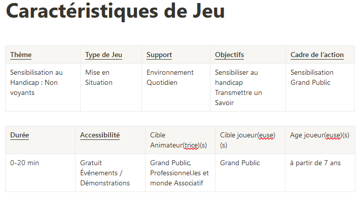

# Carnet de Bord

## Premier TP:

### Réalisations :

- Choix et caractérisation du Serious Game :

Serious Game choisi: Sensibilisation au Handicap : Non Voyants

- Création du répertoire Github : Gestion-de-Projet

## Deuxième TP:

### Réalisations :

- Mise en place du github : Kanban, Roadmap(=Gantt)
- Elaboration du Pitch de présentation
  
- Répartition des tâches :
  - Tous : Recherche documentaire, Jeux à intégrer dans notre Jeu Serieux
  - Alann : Carnet de Bord
  - Pitch de présentation : Theresia, Yannis, Wilson
  - Recherche association / Personnes en situation de handicapes :
    Jérôme

## Troisième TP:

### Réalisations :

- Pitch de présentation
- Brainstorming sur les activitées à inclure dans notre Jeu Serieux :
  - Exploration d'une pièce à l'aveugle pour ensuite dessiner son plan sur une feuille.
    - Statut : Refusé
  - Parcours d'obstacle afin de chercher un objet posé à son extrémité.
    - Statut : Retenu
  - Simulation d'une situation réelle.
    Ex : Manger, Boire, Mettre/Enlecer des objets dans un placard, etc...
    - Statut : Refusé

- Début de la préparation du Point d'étape :
  - Mise au point sur les attentes du point d'étape (cf. [Issue TP 4/6](https://github.com/Gestion-de-projet-M1-A-R/Gestion-de-projet-Org/issues/10#issuecomment-2511907329))
  - Création de la documentation (.md)

## Quatrième TP:

- séparation des taches pour le point d'étape:
  - SWOT - Wilson
  - Présentation - Mohamed
  - Documentation: Yannis, Theresia

- Préparation d'une première version du jeu pour essai en séance 5 : Theresia

Bonne coordination d'équipe et communication, besoin d'une bonne solution commune pour le travail collaboratif en direct. (en ce moment c'est plutôt chacun sa sauce)

## Cinquième TP:

- Echange avec Josiane Letourneau, trouble de la vue
- prise de notes de "l'interview" et des idées de jeu
- Réception des objets prêtés par l'unadev
- mise en place d'un prototype du jeu, fait.
- Brainstorm rédactions des documents livrables

Pour la Prochaine séance:
- trouver des objets qui irait bien et une panière, et les ramener
- Imprimer les images des objets 
- Préparer les questions d'interview pour récupérer les témoignages pour le site.
- faire un test du jeu avec un autre groupe
- trouver un moyen de protection de coins de tables
